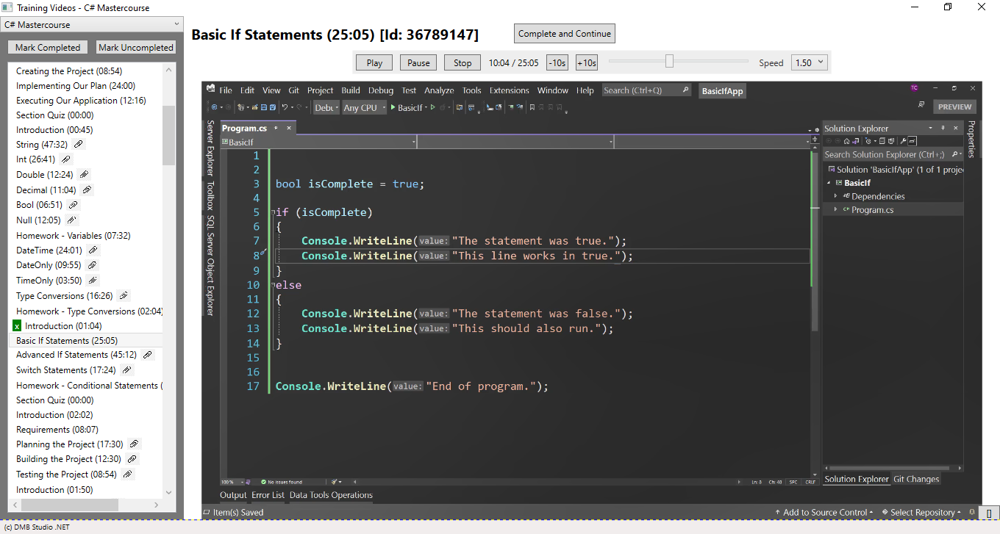

# WPF Video Visualizer

This WPF app allows to display contents and track the visualization of a set of courses, for which the contents and the completion status are stored in a SQL Server Database.

Courses are composed of sections, and each section is composed of lectures, which are the basic unit of information. Eacg oh them has an Id and a Name/Title. 

Lectures content is composed of:
- some text in HTML format
- one video of a given duration, stored locally
- some complementary files (attachments), also stored locally

An *appsettings.json* file allows to define the DB String Connection, as well as the local path to the Lectures main content folder (with `videos` and `attachments` subfolders)

The WPF UI implements the following functionality:
- Combobox to select one of the courses
- Listbox to display all of the course lectures, their duration, whether they have attachments or not, and whether they have already been completed
- Possibility to bulk mark lectures as completed/uncompleted
- A main window to visualize the contents of the selected lecture
	- Button to mark as completed and open next lecture
	- Buttons for video visualization: Play/Pause/Stop, skip 10 seconds, Go to some point, change reproduction speed
	
